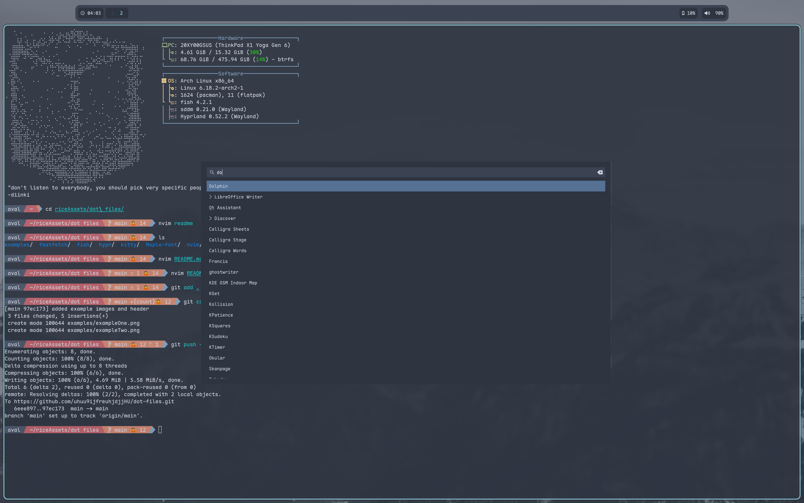
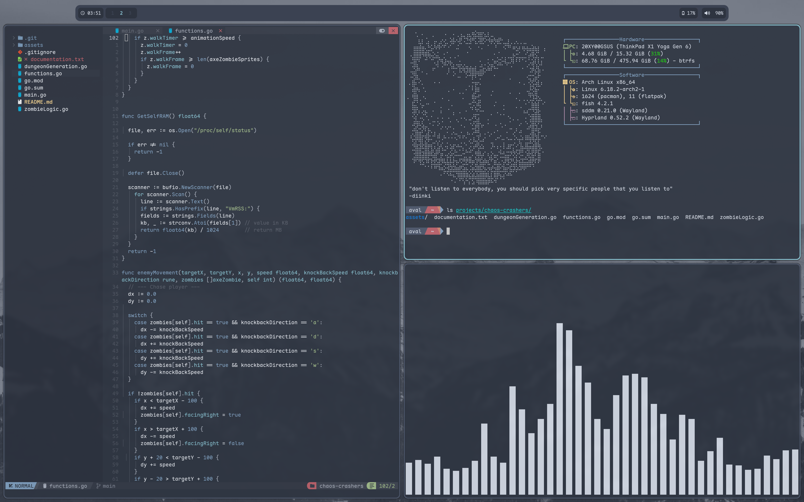
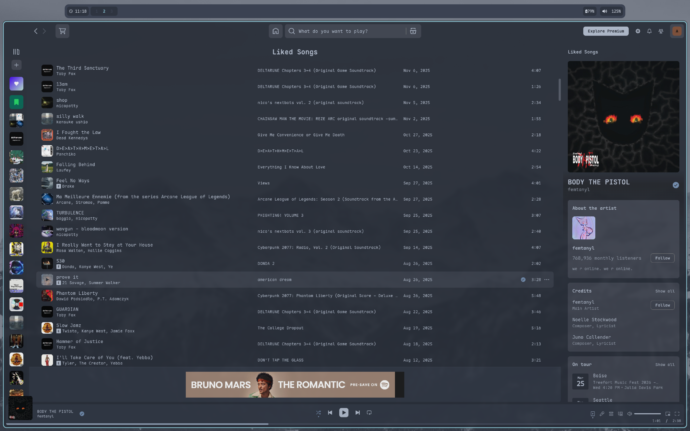

# My personal dot files for my nord rice.





assets use charecters included in maple mono font, make sure to include in system font.

nvim uses NvChad. I dont recommend copy and pasting my dot files for NvChad, you should set up and configure it from scrath only using my files as a reference.
```
Linux/macOS:

git clone https://github.com/NvChad/starter ~/.config/nvim && nvim
```

## Credits:

- waybar [diinki-retrofuture](https://github.com/diinki/diinki-retrofuture) (MIT License)

- Maple Mono [maple-font](https://github.com/subframe7536/maple-font) (SIL Open Font License)

- Wofi Nord Theme [alxndr15/wofi-nord-theme](https://github.com/alxndr13/wofi-nord-theme) (MIT License)

- NvChad [NvChad/NvChad](https://github.com/NvChad/NvChad) (GPL-3.0 license)

- starship.toml [geoffjay/starship.toml](https://gist.github.com/geoffjay/363e3b6414d651303a2b1bec1319d936) (ISC license)
